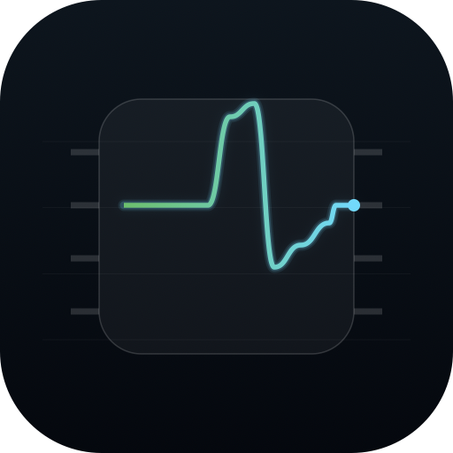

<p align="center">
  
</p>

<h1 align="center">amdgpu_mtopg</h1>

<p align="center">
  <a href="https://github.com/lemonade-sdk/amdgpu_mtopg/actions/workflows/build.yml"></a>
  <a href="LICENSE"></a>
  <a href="https://github.com/lemonade-sdk/amdgpu_mtopg/releases"></a>
</p>

<p align="center">
  <a href="https://github.com/lemonade-sdk/mac_linuxgpu">mac_linuxgpu</a> ·
  <b>amdgpu_mtopg</b> ·
  <a href="https://github.com/Geramy/LSE">LemonSeed Engine</a>
</p>


<p align="center"><sub>An AMD Radeon AI PRO R9700 over Thunderbolt 5 on an Apple M5 Max, running <a href="https://github.com/lemonade-sdk/mac_linuxgpu">mac_linuxgpu</a>, while <a href="https://github.com/Geramy/LSE">LemonSeed Engine</a> runs Qwen3.8-27B inference.</sub></p>

A live GPU monitor for AMD GPUs on macOS. A native SwiftUI app with rolling
charts for GPU load and memory activity, and readouts for VRAM, clocks,
sensors, throttling and the PCIe link.

On [mac_linuxgpu](https://github.com/lemonade-sdk/mac_linuxgpu) (the
unmodified upstream Linux amdgpu driver running in a DriverKit extension) it
reads the upstream driver's own telemetry: the device's sysfs attributes and
`AMDGPU_INFO`, the same data `amdgpu_top` reads on Linux. The reads go through
the driver's read-only observer client. It also supports the earlier
MacAMDGPU driver through that driver's observer selectors.

Every readout names its source. Nothing is shown from a source that is not
producing samples, and nothing is relabeled as something it is not: an SMU
firmware average is called an average, a packet-rate proxy is called a proxy,
and a field the firmware does not fill shows as `n/a`.

## Requirements

- macOS 14 or later on Apple Silicon.
- An AMD GPU driven by one of:
  - **mac_linuxgpu 0.1.125 or later** for the Linux data paths (sysfs and
    `AMDGPU_INFO` through the observer). 0.1.125 is the first release whose
    observer client keeps its read-only role, so earlier releases refuse the
    reads; a dext without the observer reads at all shows "predates the
    observer Linux reads".
  - **MacAMDGPU** driver build 172 or later.

The monitor is read-only. It submits no GPU work and changes no driver state.
It needs no entitlements (an IOKit user-client read needs none) and makes no
network connections.

## Install

1. Download `amdgpu_mtopg-<version>.dmg` from
   [Releases](https://github.com/lemonade-sdk/amdgpu_mtopg/releases).
2. Optionally check it against the `.sha256` file next to it:
   `shasum -a 256 -c amdgpu_mtopg-<version>.dmg.sha256`
3. Open the disk image and drag **amdgpu_mtopg** to **Applications**.
4. Launch it from Applications.

Release builds are signed with a Developer ID and notarized by Apple, with
the notarization ticket stapled to both the app and the disk image, so
Gatekeeper opens them without prompts.

The window shows the panels of whichever driver the selected GPU is bound to.
Esc or closing the window quits.

## mac_linuxgpu: what it shows

All values come from the upstream driver's own code paths, through the dext's
read-only observer client (user-client type 1):

- **GPU LOAD**: the fraction of `GRBM_STATUS` reads with `GUI_ACTIVE` set
  over a rolling 2 s window, sampled through `AMDGPU_INFO_READ_MMR_REG` five
  times per 100 ms, as `amdgpu_top` computes GFX activity. This is GFX
  pipeline active time, not CU occupancy. The register offset is the GC
  segment base from the device's `ip_discovery/die/0/GC/0/base_addr` plus
  `regGRBM_STATUS` (0x0da4, the SOC15 GC layout); upstream checks it against
  the ASIC's allowed-register list. Reading the register makes upstream hold
  GFXOFF off briefly each time, as on Linux; set `MTOPG_NO_GRBM=1` to sample
  nothing and fall back. Without samples the chart shows sysfs
  `gpu_busy_percent`, the SMU's average GFX activity, labeled as such.
- **MEMORY ACTIVITY**: sysfs `mem_busy_percent` (the SMU's memory controller
  activity average), with `gpu_metrics` `average_umc_activity` next to it.
  These are firmware averages, not bandwidth.
- **VRAM / GTT**: `mem_info_vram_used/total`, `mem_info_vis_vram_*` and
  `mem_info_gtt_used/total`, the TTM managers' usage.
- **Clocks**: `gpu_metrics` `current_*` and `average_*_frequency` for GFX,
  memory and SOC, and the `pp_dpm_sclk/mclk/socclk/fclk` level tables with the
  current level in brackets. Some SMU generations fill `current_*` from
  averages; the panel shows what the driver reports.
- **Sensors**: the `hwmon/hwmonN/` directory (found by listing `hwmon/`):
  `temp*_input` with the driver's own `temp*_label` (edge, junction, mem),
  `power1_average`/`power1_input` against `power1_cap`, `fan1_input`,
  `in*_input` with labels, and `freq*_input`.
- **Throttling**: `gpu_metrics` `indep_throttle_status` decoded with the
  ASIC-independent `SMU_THROTTLER_*` bits, and the raw, ASIC-specific
  `throttle_status`.
- **PCIe link**: `current_link_speed/width` and `max_link_*` (the pci-sysfs
  attributes: the card's own link, which through Thunderbolt is the link to
  the enclosure, not the whole path), the SMU's view from `gpu_metrics`, and
  `pp_dpm_pcie`.

`gpu_metrics` is decoded by its own header (`format_revision`,
`content_revision`) with the upstream struct layouts, never by ASIC.
`Sources/GPUMetricsLayout.swift` is generated from
`third_party/kgd_pp_interface.h` by `gen_gpu_metrics.py`; the C compiler
computes the offsets. The discrete-GPU formats 1.0 to 1.8 are decoded; other
formats show their version and are not decoded. Fields the SMU does not fill
read back all-ones and display as `n/a`.

The MacAMDGPU selector panels (SQ busy, per-engine packet rates) have no
counterpart in the upstream driver and are not shown for mac_linuxgpu.
Until the upstream driver runs in a GPU session (a compute client initializes
it), the dext answers "not ready" and the panels say so.

The observer runs on its own dext queue: it neither waits behind a session's
ioctls nor delays them, never claims PCI, never joins the session and never
touches queues. The monitor keeps one observer connection per GPU, held while
the GPU is present (an observer never holds the session open), and reads the
slow attributes about once a second.

## MacAMDGPU: what it shows

- **GPU CORE LOAD**: with driver build 203+, a 60 s chart of the rolling
  fraction of `GRBM_STATUS.GUI_ACTIVE` samples (selector 71). This estimates
  GFX active time at the 10 Hz poll cadence, not CU occupancy or shader busy
  cycles. Older drivers use the GFX submitted-packet rate from selector 61,
  scaled to the peak observed in this session; that fallback is an activity
  proxy.
- **UMC MEMORY ACTIVITY**: unavailable on gfx1201. The decoded SMU 0x33
  `UmcActivityPercent` field has reported activity at idle and near zero under
  verified traffic, so it appears in the separate `UCLK avg (SMU raw)` meter
  instead. A UMC busy chart needs a hardware counter. The former selector 68
  MMHUB PERFSTATUS address is unmapped on gfx1201; build 199+ reports it
  unavailable rather than a live UMC busy counter.
- **VRAM / GTT**: the driver's CPU allocator pools (query tag 5).
- **Clocks (SMU)**: raw firmware `CurrClock[]` for SOC, memory and fabric,
  plus the advertised AC DPM min to max. GFX shows the fresh SMU average at
  both initialized idle and load, labeled as an average; its raw
  `CurrClock[]` field stays visible below. On the uncalibrated 0x33 profile,
  raw GFX has stayed at 1000 MHz during load, while its average has risen
  above 3 GHz at idle. Neither should be mistaken for a separately verified
  instantaneous core frequency. An average outside the advertised DPM maximum
  is flagged. DPM levels are advertised AC operating states; deep-sleep
  averages can fall below their minimum.
- **Sensors (SMU)**: firmware GFX and UCLK activity, socket/board power,
  edge/hotspot temperature and fan. The 0x33 firmware profile is not
  independently calibrated: GFX activity has read 100% at initialized idle and
  decoded power has stayed near 300 W while workload activity changed. The
  decoded GFX/UCLK activity and power fields stay visible in meter bars with
  `SMU raw` labels, separate from the hardware-sampled GPU load chart. An
  enclosure AC wattmeter can check the idle-to-load input-power change, though
  its reading includes PSU and enclosure losses and is not GPU board power.
  [Linux SMU 14.0.2](https://github.com/torvalds/linux/blob/master/drivers/gpu/drm/amd/pm/swsmu/smu14/smu_v14_0_2_ppt.c)
  maps GPU load to `AverageGfxActivity` and average socket power to
  `AverageSocketPower` under driver interface 0x2e. The RDNA4 firmware this
  was tested on advertises 0x33, and the idle and load readings have not
  established an equivalent calibration.
- **Engines**: per-engine submitted-packet rates scaled to observed peaks
  (SDMA0/SDMA1/GFX/AQL from selector 61). HSA dispatches can be outside these
  counters; an empty row means no packet observed by this endpoint, not that
  the GPU was idle. VCN/JPEG have no observer counter.

SMU values need an initialized GPU session (driver stage 15). The monitor
calls the bounded observer sensor sampler (selector 63) at most once per
second, then reads the cached metrics and clock snapshots. At stage 0 the SMU
readings are unavailable.

## Build from source

Requires the Xcode command line tools (`xcode-select --install`).

```sh
./build.sh            # -> build/amdgpu_mtopg.app (ad-hoc signed)
./build.sh --clean    # rebuild from scratch
open build/amdgpu_mtopg.app
```

Plain `swiftc` against the macOS SDK, system frameworks only (SwiftUI, AppKit,
IOKit, CoreFoundation). The bundle is ad-hoc signed (`codesign --force -s -`),
with no entitlements.

### Signed releases

```sh
scripts/release.sh    # -> build/amdgpu_mtopg-<version>.dmg and .sha256
```

`scripts/release.sh` builds from scratch, signs the app with a Developer ID
and the hardened runtime, notarizes the app and then the disk image with
`xcrun notarytool`, staples both tickets, and writes the image's SHA-256.
Environment:

| variable | default | meaning |
|---|---|---|
| `SIGN_IDENTITY` | `Developer ID Application` | `codesign` identity |
| `NOTARY_PROFILE` | `AC_PASSWORD` | `notarytool` keychain profile, created once with `xcrun notarytool store-credentials` |
| `SKIP_NOTARIZE` | unset | `1` signs only; the image will not pass Gatekeeper on other Macs |

### Offline checks

The gpu_metrics layouts and an offline check of the mac_linuxgpu model need
no driver and no GPU. Both default to the vendored upstream header,
`third_party/kgd_pp_interface.h`, and take another copy of the header as an
argument:

```sh
./check_linux_model.sh     # decode a C-filled gpu_metrics_v1_3, pp_dpm parsing, snapshot sources
./gen_gpu_metrics.py       # regenerate Sources/GPUMetricsLayout.swift
git diff --exit-code -- Sources/GPUMetricsLayout.swift
```

`check_linux_model.sh` compiles a C program that fills upstream
`struct gpu_metrics_v1_3` the way the SMU code does (all-ones, then the
header, then fields); the Swift decoder must find every field by the blob's
header alone. The `pp_dpm_*` parser and the snapshot's labels, GRBM fraction
and fallbacks are checked against fixed sysfs text.

CI runs the build, both checks and the layout diff on every push.

## Data source

**mac_linuxgpu**: `IOServiceGetMatchingServices("MacLinuxGPU")`, one
persistent `IOServiceOpen(..., 1)` observer connection per GPU, and
`IOConnectCallMethod` on these selectors (defined in mac_linuxgpu
[`dext/sources/session_state.h`](https://github.com/lemonade-sdk/mac_linuxgpu/blob/main/dext/sources/session_state.h)):

| selector | payload |
|---|---|
| 80 SysfsRead | in: op (0 read, 1 list), byte offset; struct in: path relative to the device directory; out: Linux errno, bytes, full length; struct out: up to 4096 bytes |
| 81 DrmInfo | in: AMDGPU_INFO query, size; struct in: the request's argument union; out: Linux errno; struct out: the result |
| 21 | QueryInfo tag "LPRO" (probe status: whether the upstream driver runs) |
| 43 | runtime build |

**MacAMDGPU**: `IOServiceGetMatchingServices("MacAMDGPU")`, per-refresh
`IOServiceOpen` / `IOConnectCallScalarMethod` / `IOConnectCallStructMethod` /
`IOServiceClose` on the driver's read-only observer client:

| selector | payload |
|---|---|
| 43 | identity: magic, 1, driver build |
| 21 | QueryInfo tags 1 (gfx version), 2 (VRAM), 4 (stage), 5 (VRAM accounting) |
| 47 | SMU metrics snapshot (192 B) |
| 61 | software_stats snapshot (456 B): per-engine dispatch counters |
| 62 | SMU clock snapshot (96 B) |
| 63 | bounded SMU sensor-cache refresh (3 x u64; stage 15) |
| 68 | unavailable MMHUB UMC source on gfx1201 (4 x u64; build 198+) |
| 69 | workload SQ busy-cycle slot (5 x u64; build 200+) |
| 70 | driver SQ busy-cycle sample (5 x u64; build 200+) |
| 71 | passive GRBM_STATUS sample (3 x u64; build 203+) |
| 72 | cached, allowlisted raw SMU fields for schema diagnostics (208 B struct; build 204+) |
| 73 | GFXSpec chip geometry (128 B struct; build 204+) |

Struct endpoints are decoded from raw byte buffers at the C offsets (Swift's
layout of C++ mirror structs is not reliable); the C sizes are asserted by the
driver headers. The IOKit iterator and connections are released on exit.

## Files

- `Sources/App.swift`: app, delegate and the 10 Hz sampler thread.
- `Sources/GPUDriver.swift`: IOKit transport, MacAMDGPU ABI and validators.
- `Sources/LinuxDriver.swift`: mac_linuxgpu observer transport and gpu_metrics decoder.
- `Sources/GPUMetricsLayout.swift`: generated gpu_metrics struct layouts.
- `Sources/LinuxModel.swift`: mac_linuxgpu history and snapshot.
- `Sources/LinuxViews.swift`: mac_linuxgpu panels.
- `Sources/MonitorModel.swift`: rolling history, rate math and snapshot.
- `Sources/Views.swift`: SwiftUI Canvas charts and panels.
- `gen_gpu_metrics.py`, `check_linux_model.sh`: layout generator and offline check.
- `third_party/kgd_pp_interface.h`: upstream Linux header, unmodified.
- `build.sh`: build, bundle and ad-hoc sign.
- `scripts/release.sh`: Developer ID signing, notarization and the disk image.

## Environment variables

| variable | effect |
|---|---|
| `MTOPG_NO_GRBM=1` | mac_linuxgpu: do not sample `GRBM_STATUS`; GPU load falls back to `gpu_busy_percent` |
| `MTOPG_DEBUG=1` | log one line per refresh to stderr: each device, its driver and its read status |

## Related projects

- **[mac_linuxgpu](https://github.com/lemonade-sdk/mac_linuxgpu):** the
  unmodified upstream Linux `amdgpu` + `amdkfd` driver running on macOS in a
  DriverKit extension. It provides the telemetry this monitor reads.
- **[LemonSeed Engine](https://github.com/Geramy/LSE):** LLM inference on AMD
  GPUs through HRX/Loom. It runs on mac_linuxgpu, and its HumanEval+ results
  on the R9700 are below.


## License

MIT; see [LICENSE](LICENSE). `third_party/kgd_pp_interface.h` is vendored
unmodified from upstream Linux (commit
`1f63dd8ca0dc05a8272bb8155f643c691d29bb11`) and keeps AMD's MIT notice.
